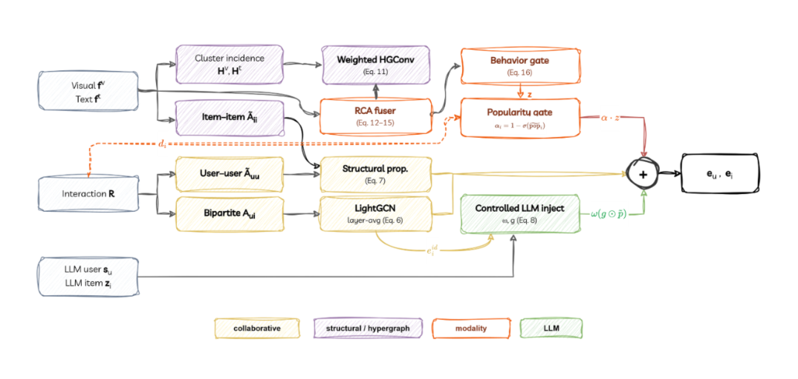

# DISCREN: Denoised Semantic Cross-modal Reciprocal Hypergraph Recommender with Controlled LLM Injection

This is the official PyTorch implementation for the research paper: **DISCREN: Denoised Semantic Cross-modal Reciprocal Hypergraph Recommender with Controlled LLM Injection**.

🚀 **DISCREN** is an advanced multimodal recommender framework designed to alleviate severe data sparsity, popularity bias, and modality noise in recommendation. It integrates:
1. **Reciprocal Cross-Modal Attention (RCA)**: Iterative gated cross-modal attention refining visual and textual representations.
2. **Weighted Hypergraph Convolution (WHGConv)**: Continuous TF-IDF / cosine weighted message passing over high-order item-item semantic clusters.
3. **Popularity-Gated Fusion**: Degree-scaled dynamic coefficient ($\alpha$) modulating content injection to protect head items while boosting long-tail cold items.
4. **Controlled LLM Injection with MAE Denoising**: Attenuable learnable gate ($\omega$) and masked feature reconstruction to robustify LLM-generated semantic profiles.

---

## 1. Architecture Overview

<p align="center">
  
</p>

---

## 2. Dependencies & Installation

The codebase has been verified under **Python 3.10** with **PyTorch 2.0+** on NVIDIA GPUs (RTX 3090 / A100). Install all dependencies via:

```bash
pip install -r requirements.txt
```

Key dependencies:
- [PyTorch](https://pytorch.org/) >= 2.0.1
- [PyTorch Geometric](https://pyg.org/) >= 2.3.0
- `numpy >= 1.24.3`
- `scipy >= 1.10.1`
- [scikit-learn](https://scikit-learn.org/) >= 1.2.2
- `pyyaml >= 6.0`

---

## 3. Datasets & Pretrained Models

The benchmark recommendation datasets are based on [Amazon Product Data](http://jmcauley.ucsd.edu/data/amazon/links.html) (Clothing, Sports) and [MMSSL](https://github.com/HKUDS/MMSSL) / [LATTICE](https://github.com/CRIPAC-DIG/LATTICE) / [MMHCL](https://huggingface.co/datasets/Xu-SII-BNU/MMHCL).

✨ **Pre-processed Datasets & Pre-trained Checkpoints**:
All pre-processed multimodal datasets (including raw visual/textual features, LLM-generated profile texts, and semantic embeddings) alongside pre-trained best model checkpoints are available on Google Drive:
- 📥 **[Download Datasets & Pretrained Weights (Google Drive)](https://drive.google.com/file/d/1gpxFvMXXuz3XpmyZj-qJeaIcFjgyItbU/view?usp=sharing)**

| Dataset | # Users | # Items | # Interactions | Sparsity | Modalities |
| :--- | :---: | :---: | :---: | :---: | :---: |
| **Amazon-Clothing** | 21,399 | 23,033 | 148,817 | 99.97% | Visual (4096-d) + Text (1024-d) + LLM (1024-d) |
| **Amazon-Sports** | 35,598 | 18,395 | 296,337 | 99.95% | Visual (4096-d) + Text (1024-d) + LLM (1024-d) |

Directory layout:
```
discren/
├── data/
│   ├── Clothing/
│   │   ├── 5-core/
│   │   │   ├── train.json
│   │   │   ├── val.json
│   │   │   └── test.json
│   │   ├── image_feat.npy
│   │   ├── text_feat.npy
│   │   ├── user_profile_feat.npy
│   │   ├── text_llm_feat.npy
│   │   ├── user_profiles.txt
│   │   └── item_profiles.txt
│   └── Sports/
│       ├── 5-core/
│       │   ├── train.json
│       │   ├── val.json
│       │   └── test.json
│       ├── image_feat.npy
│       ├── text_feat.npy
│       ├── user_profile_feat.npy
│       ├── text_llm_feat.npy
│       ├── user_profiles.txt
│       └── item_profiles.txt
```

---

## 4. Usage

### 4.1 Training
Train DISCREN on **Amazon-Clothing** or **Amazon-Sports**:
```bash
# Train on Clothing
python train.py --config configs/clothing_full.yaml --dataset Clothing

# Train on Sports
python train.py --config configs/sports_full.yaml --dataset Sports
```

### 4.2 Evaluation
Evaluate a trained model checkpoint on the test set:
```bash
python eval.py --config configs/clothing_full.yaml --checkpoint checkpoints/Clothing_best.pt --dataset Clothing
```

---

## 5. Experimental Results

### 5.1 Benchmark Comparison with SOTA Baselines

<p align="center">
  
</p>

| Method Category | Model | Clothing Recall@20 | Clothing NDCG@20 | Sports Recall@20 | Sports NDCG@20 |
| :--- | :--- | :---: | :---: | :---: | :---: |
| **Traditional CF** | MF-BPR (Rendle et al., 2009) | 0.0191 | 0.0088 | 0.0431 | 0.0203 |
| **Graph-based CF** | NGCF (Wang et al., 2019) | 0.0387 | 0.0168 | 0.0696 | 0.0319 |
| | LightGCN (He et al., 2020) | 0.0470 | 0.0215 | 0.0781 | 0.0370 |
| | SGL (Wu et al., 2021) | 0.0598 | 0.0265 | 0.0779 | 0.0361 |
| **Multimodal CF & GNN** | VBPR (He & McAuley, 2016) | 0.0481 | 0.0219 | 0.0582 | 0.0268 |
| | MMGCN (Wei et al., 2019) | 0.0501 | 0.0228 | 0.0639 | 0.0291 |
| | GRCN (Wei et al., 2020) | 0.0631 | 0.0279 | 0.0834 | 0.0384 |
| | SLMRec (Tao et al., 2022) | 0.0670 | 0.0297 | 0.0829 | 0.0380 |
| | LATTICE (Zhang et al., 2021) | 0.0710 | 0.0316 | 0.0915 | 0.0424 |
| | MMSSL (Wei et al., 2023) | 0.0740 | 0.0331 | 0.0998 | 0.0447 |
| | LGMRec (Guo et al., 2024) | 0.0781 | 0.0345 | 0.1007 | 0.0451 |
| | FREEDOM (Zhou et al., 2023) | 0.0812 | 0.0359 | 0.0987 | 0.0436 |
| **Hypergraph SOTA** | MMHCL (Guo et al., 2024 / 2025) | 0.0881 | 0.0394 | 0.1064 | 0.0501 |
| **Ours** | DISCREN w/o LLM | 0.0883 | 0.0394 | 0.1068 | 0.0494 |
| | **DISCREN Full** | **0.0902** | **0.0404** | **0.1096** | **0.0501** |
| | **DISCREN Full ($d=128$)** | **0.0949** | **0.0424** | **0.1137** | **0.0519** |

---

### 5.2 Relative Performance Gains over SOTA (MMHCL)

| Configuration | Dataset | Metric | SOTA (MMHCL) | DISCREN | Relative Gain ($\Delta\%$) |
| :--- | :--- | :--- | :---: | :---: | :---: |
| **DISCREN Full** | **Amazon Clothing** | Recall@20<br>NDCG@20 | 0.0881<br>0.0394 | 0.0902<br>0.0404 | **+2.38%**<br>**+2.54%** |
| | **Amazon Sports** | Recall@20<br>NDCG@20 | 0.1064<br>0.0501 | 0.1096<br>0.0501 | **+3.01%**<br>**0.00%** |
| **DISCREN Full ($d=128$)** | **Amazon Clothing** | Recall@20<br>NDCG@20 | 0.0881<br>0.0394 | 0.0949<br>0.0424 | **+7.72%**<br>**+7.61%** |
| | **Amazon Sports** | Recall@20<br>NDCG@20 | 0.1064<br>0.0501 | 0.1137<br>0.0519 | **+6.86%**<br>**+3.59%** |

---

### 5.3 Robustness & Ablation Studies

<p align="center">
  
  
</p>

---

## 6. Citation

If you find this work helpful to your research, please kindly consider citing:

```bibtex
@article{discren2026,
  title={DISCREN: Denoised Semantic Cross-modal Reciprocal Hypergraph Recommender with Controlled LLM Injection},
  author={Sean and Loc, Truong},
  journal={arXiv preprint},
  year={2026}
}
```

---

## 7. Acknowledgements

The structure of this code is based on and inspired by [MMSSL](https://github.com/HKUDS/MMSSL), [LATTICE](https://github.com/CRIPAC-DIG/LATTICE), and [MMHCL](https://github.com/Xu-SII-BNU/MMHCL). We thank the authors for open-sourcing their codebases.
