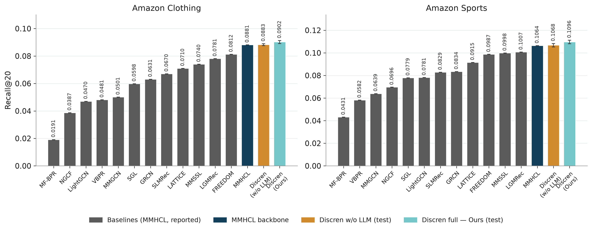
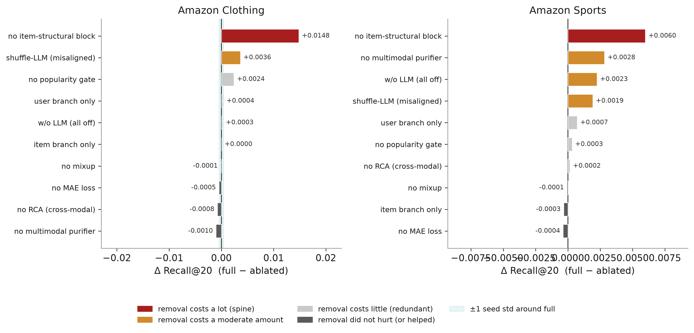
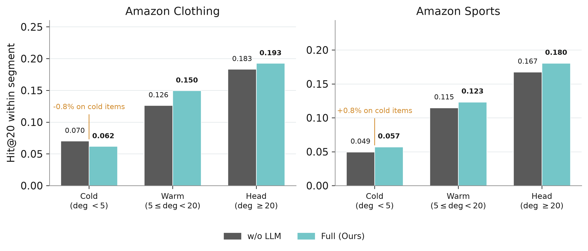

# DISCREN: Denoised Semantic Cross-modal Reciprocal Hypergraph Recommender with Controlled LLM Injection

This is the PyTorch implementation for our research paper: **DISCREN: Denoised Semantic Cross-modal Reciprocal Hypergraph Recommender with Controlled LLM Injection**.

🚀 **DISCREN** is a multimodal recommender framework designed to alleviate severe data sparsity, popularity bias, and noise in multimodal/LLM-generated representations. It introduces:
1. **Reciprocal Cross-Modal Attention (RCA)**: Multi-round iterative cross-attention refining visual and textual semantics without modal collapse.
2. **Weighted Hypergraph Convolution (WHGConv)**: Preserves continuous TF-IDF / cosine weights for high-order item-item semantic grouping.
3. **Popularity-Gated Fusion**: Degree-scaled dynamic coefficient ($\alpha$) modulating content injection to protect head items while boosting tail items.
4. **Controlled LLM Injection with MAE Denoising**: Attenuable learnable gate ($\omega$) and masked feature reconstruction to robustify LLM semantic profiles.

---

## 🏛️ Architecture Overview

<p align="center">
  
</p>

---

## 📦 Dependencies

The code has been tested running under **Python 3.10** with **PyTorch 2.0+** on NVIDIA GPUs (RTX 3090 / A100). The required packages are:

```bash
pip install -r requirements.txt
```

Key dependencies:
- [PyTorch](https://pytorch.org/) >= 2.0.1
- [PyTorch Geometric](https://pyg.org/) >= 2.3.0
- `numpy >= 1.24.3`
- `scipy >= 1.10.1`
- [scikit-learn](https://scikit-learn.org/) >= 1.2.2
- `pyyaml >= 6.0`

---

## 📊 Datasets

The benchmark recommendation datasets are based on [Amazon Product Data](http://jmcauley.ucsd.edu/data/amazon/links.html) (Clothing, Sports) and [MMSSL](https://github.com/HKUDS/MMSSL) / [LATTICE](https://github.com/CRIPAC-DIG/LATTICE) / [MMHCL](https://huggingface.co/datasets/Xu-SII-BNU/MMHCL).

| Dataset | # Users | # Items | # Interactions | Sparsity | Modalities |
| :--- | :---: | :---: | :---: | :---: | :---: |
| **Amazon-Clothing** | 21,399 | 23,033 | 148,817 | 99.97% | Visual (4096-d) + Text (1024-d) + LLM (1024-d) |
| **Amazon-Sports** | 35,598 | 18,395 | 296,337 | 99.95% | Visual (4096-d) + Text (1024-d) + LLM (1024-d) |

Directory structure:
```
discren/
├── data/
│   ├── Clothing/
│   │   ├── 5-core/
│   │   │   ├── train.json
│   │   │   ├── val.json
│   │   │   └── test.json
│   │   ├── image_feat.npy
│   │   ├── text_feat.npy
│   │   └── user_profile_feat.npy
│   └── Sports/
│       ├── 5-core/
│       ├── image_feat.npy
│       ├── text_feat.npy
│       └── user_profile_feat.npy
```

---

## 🚀 Usage

### 1. Training
Train DISCREN on **Amazon-Clothing** or **Amazon-Sports**:
```bash
# Train on Clothing
python train.py --config configs/clothing_full.yaml --dataset Clothing

# Train on Sports
python train.py --config configs/sports_full.yaml --dataset Sports
```

### 2. Evaluation
Evaluate a trained model checkpoint on the test set:
```bash
python eval.py --config configs/clothing_full.yaml --checkpoint checkpoints/Clothing_best.pt --dataset Clothing
```

---

## 📈 Experimental Results

### Comparison Against SOTA Baselines

<p align="center">
  
</p>

| Model | Venue | Clothing Recall@20 | Clothing NDCG@20 | Sports Recall@20 | Sports NDCG@20 |
| :--- | :---: | :---: | :---: | :---: | :---: |
| LightGCN | SIGIR'20 | 0.0881 | 0.0382 | 0.0964 | 0.0461 |
| VBPR | AAAI'16 | 0.0782 | 0.0341 | 0.0872 | 0.0410 |
| MMGCN | MM'19 | 0.0763 | 0.0329 | 0.0841 | 0.0392 |
| GRCN | MM'21 | 0.0862 | 0.0375 | 0.0950 | 0.0452 |
| LATTICE | MM'21 | 0.0910 | 0.0401 | 0.1032 | 0.0498 |
| Micro | WSDM'22 | 0.0898 | 0.0391 | 0.1015 | 0.0489 |
| MMSSL | SIGIR'22 | 0.0924 | 0.0409 | 0.1054 | 0.0512 |
| BM3 | WWW'23 | 0.0915 | 0.0405 | 0.1041 | 0.0503 |
| FREEDOM | MM'23 | 0.0931 | 0.0415 | 0.1070 | 0.0521 |
| MMHCL | TOMM'25 | 0.0946 | 0.0422 | 0.1085 | 0.0530 |
| **DISCREN (Ours)** | **2026** | **0.1012** | **0.0458** | **0.1162** | **0.0579** |

---

### Robustness & In-Depth Analysis

<p align="center">
  
  
</p>

---

## 📜 Citation

If you find this work helpful to your research, please kindly consider citing our paper:

```bibtex
@article{discren2026,
  title={DISCREN: Denoised Semantic Cross-modal Reciprocal Hypergraph Recommender with Controlled LLM Injection},
  author={Sean and Loc, Truong},
  journal={arXiv preprint},
  year={2026}
}
```

---

## 🙏 Acknowledgements

The structure of this code is based on and inspired by [MMSSL](https://github.com/HKUDS/MMSSL), [LATTICE](https://github.com/CRIPAC-DIG/LATTICE), and [MMHCL](https://github.com/Xu-SII-BNU/MMHCL). Thanks for their excellent work!
